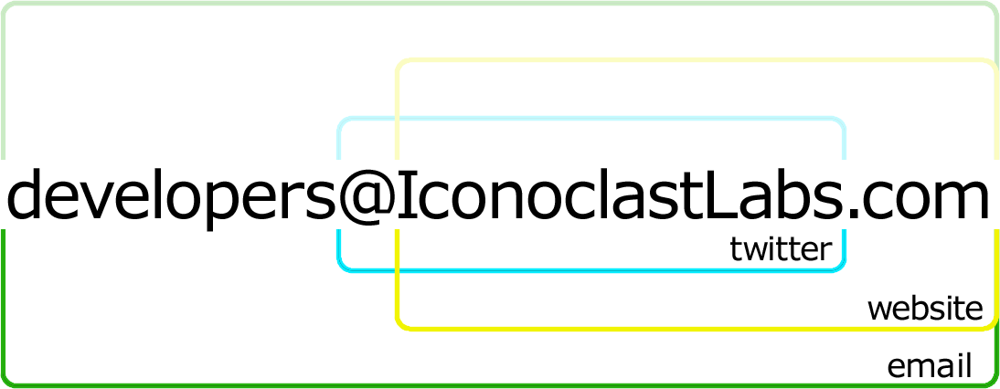

Introduction to RubyMotion - The Cool Way to Build iOS Apps
================
* Presented at [GNO code](https://twitter.com/gnocode) on October 10th, 2013
* Presented (Lightning Talk Format) at [RubyConf](http://www.RubyConf.org) on November 9th, 2013

### `--->` [View Presentation Slides](http://gantman.github.io/RubyMotion-Intro/)
[Printable Slides - Chrome Only](http://gantman.github.io/RubyMotion-Intro/?print-pdf#/)

## Mentions, References, &amp; Links
#### People
* Iconoclast Labs - [LINK](http://www.IconoclastLabs.com)
* [@IconoclastLabs](https://twitter.com/iconoclastlabs) Twitter
* [@GantLaborde](https://twitter.com/GantLaborde) Twitter
* [@MattSGarrison](https://twitter.com/mattsgarrison) Twitter
* RubyMotion Meetup - [LINK](http://meetup.rubymotion.com/)

#### Code
* Hello World App Source - [LINK](https://github.com/GantMan/HelloWorld)
* Packt Publishing RubyMotion Book - [LINK](http://www.amazon.com/Instant-RubyMotion-App-Development-ebook/dp/B00E5DH4LG/ref=sr_1_1?ie=UTF8&qid=1380089322&sr=8-1&keywords=RubyMotion+app+development)
* RubyTrivia - [LINK](https://github.com/IconoclastLabs/rubytrivia)
* Sugarcube Gem - [LINK](https://github.com/rubymotion/sugarcube)
* Asteroids Game Base Tutorial - [LINK](http://blog.rubymotion.com/post/57465814533/create-an-asteroids-game-for-ios-in-15-minutes-with)

#### Ancillary References n Stuff
* RubyMotion Site - [LINK](http://www.rubymotion.com/)
* Fun Stickers - [LINK](http://www.redbubble.com/people/gantman/shop/stickers?ref=portfolio_product_refinement)
* under_score better than camelCase - [LINK](http://www.cs.kent.edu/~jmaletic/papers/ICPC2010-CamelCaseUnderScoreClouds.pdf)
* Joybox gem - [LINK](http://joybox.io/)
* Founder of Integrallis Using Joybox - [LINK](http://www.infoq.com/news/2013/09/ios-games-ruby)
* Joybox Documentation - [LINK](https://github.com/CurveBeryl/Joybox-Documentation)

